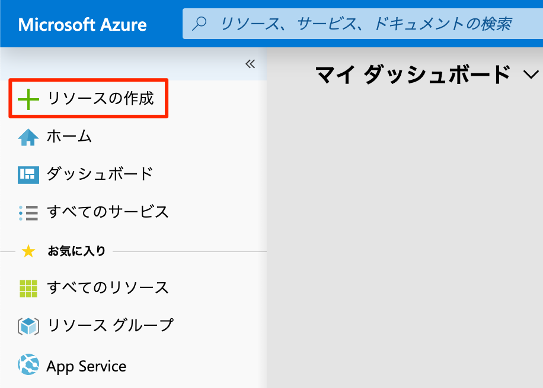
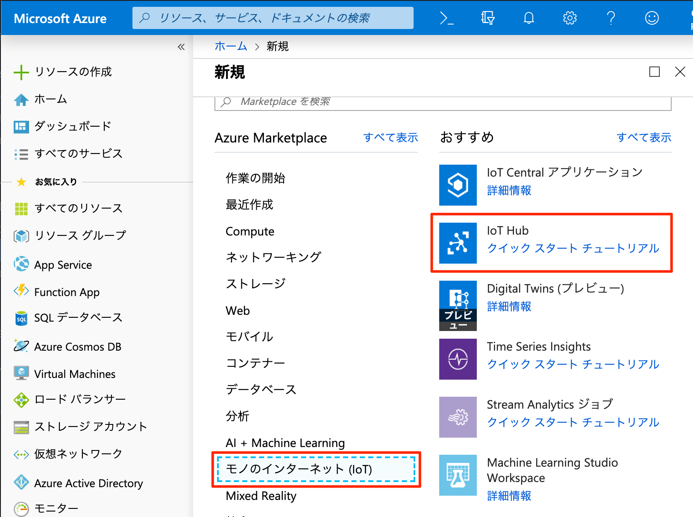
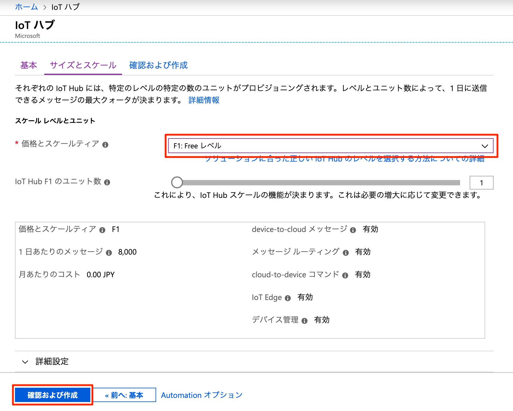
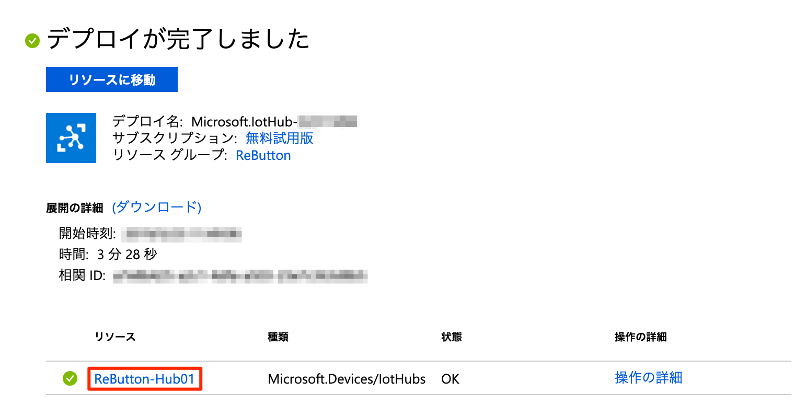
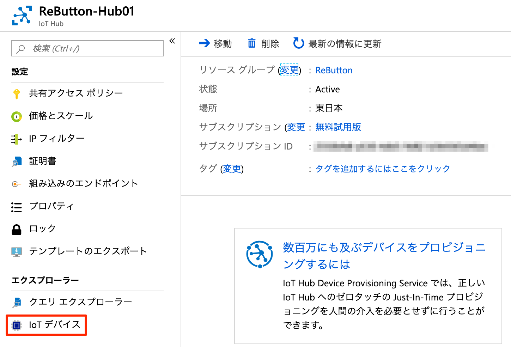
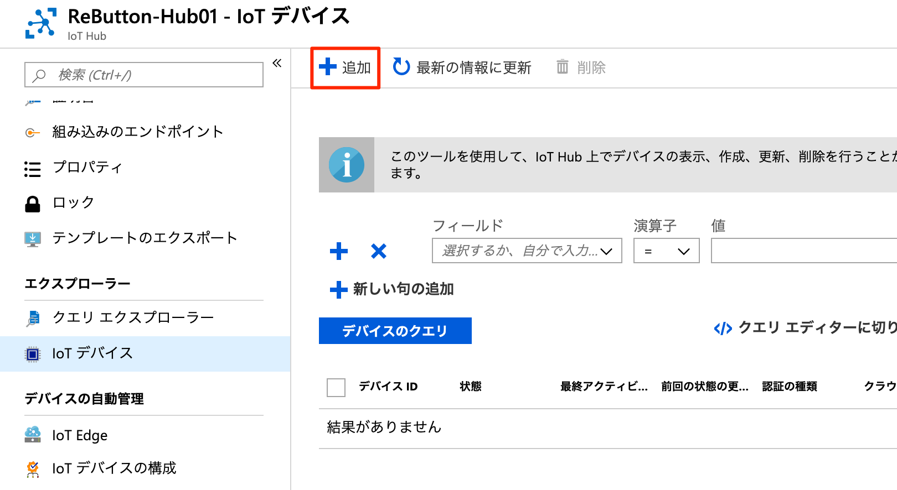
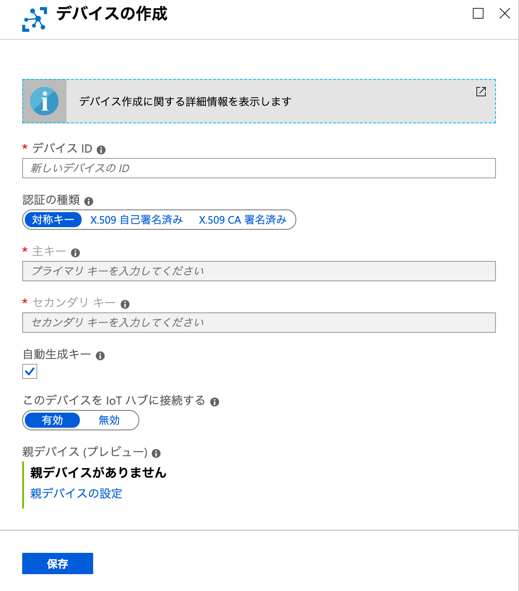
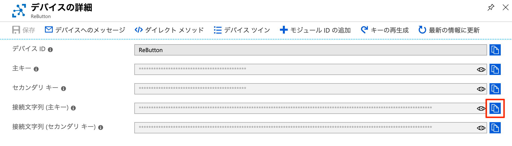

# Azure IoTを始めよう
---
免責事項
このページは、ユーザーの利便性を高めるために提供されています。 Seeedは、誤りや記載漏れ、またはこの情報の使用によって得られた結果について一切責任を負いません。 このページの情報はすべて「現状のまま」提供され、完全性、正確性、適時性、またはこの情報の使用から得られる結果の保証はありません。

---

Azure IoT Hubの詳細については、[Azure IoT Hub](https://docs.microsoft.com/ja-jp/azure/iot-hub/about-iot-hub)をご覧ください。

IoT Hubの料金階層については[IoT Hub pricing](https://azure.microsoft.com/ja-jp/pricing/details/iot-hub/)のページから確認できます。

## Step 1 : Azureポータルにログインする

有効なAzureサブスクリプションが紐付いていない場合、IoT Hubを始める前に[Azureの無料アカウント](https://azure.microsoft.com/free)を作成します。

## Step 2 : Azure IoT Hubを作成する

### 2.1 : ブラウザ上で[Azure Portal](http://portal.azure.com) に移動します

### 2.2 : 左上の`リソースの作成`をクリックします。



### 2.3 : `モノのインターネット(IoT)`から`IoT Hub`を選びます。



### 2.4 : 必要事項を埋める

|フィールド名      | 説明  |
|----------------|---------|
|サブスクリプション | あなたのサブスクリプションです。リストから選んでください。|
|リソースグループ   |  すべてのリソースを管理するためのリソースグループです。リストの中からすでにあるグループを選ぶか、新しく作成してください。|
|リージョン        | Azureのデータセンターのロケーションです。あなたの地域に近いものを選んでください。|
|IoT Hub名       |IoT Hub用にグローバルでユニークな名前をつけてください。|


### 2.5 : サイズとスケール

サイズとスケールをクリックし、`F1:Freeレベル`を選択します。  

_※１つのサブスクリプションにつき、1つのF1:Freeレベルを選択できます。すでにF1レベルのIoT Hubがある場合は、 有料レベルのIoT Hubを登録しなれければいけません。適切なレベルの選択については[こちら](https://docs.microsoft.com/ja-jp/azure/iot-hub/iot-hub-scaling)のページをご覧ください。_

### 2.6 : `確認および作成`ボタンをクリックする



### 2.7 : Azure IoT Hubを作成する

設定を確認した後、`作成`ボタンをクリックします。

デプロイが完了するまで、少しおまちください。

## Step 3 : IoTデバイスを作成する

### 3.1 : Navigate to Azure IoT Hub instance

Azure IoT Hubがデプロイされたあと、Azure IoT Hubのリソースをクリックすると、作成されたばかりのAzure IoT Hubのインスタンスに移動します。



### 3.2 : IoTデバイスの作成

`IoT デバイス`をクリックします。



### 3.3 : `追加`ボタンをクリックする

新しいIoTデバイスをAzure IoT Hub追加します。



### 3.4 : 新しいIoTデバイスに名前をつける

ReButtonのデバイスID(名前)を設定して、`保存`をクリックします。



### 3.5 : ReButtonのために新しくIoTデバイスが作成されたことを確認します。
### 3.5 : Verify a new IoT Device for ReButton is created


## Step 4 : ReButtonとAzure IoT Hubを接続する

ReButtonとAzure IoT Hubを安全に接続するために、Connection String(接続文字列)をReButtonに保存する必要があります。

### 4.1 : デバイスの詳細ページを開く

新しく作られたIoTデバイス(例:ReButton)をクリックして、`デバイスの詳細`ページを開きます。

### 4.2 : `接続文字列`をコピーする

テキストボックスの右側にあるコピーボタンをクリックして、接続文字列(主キー)か接続文字列(センダリ キー）のどちらかをコピーしてください。




### 4.3 : 接続文字列をReButtonに保存する。

[3-1. Azure IoT Hub](README-ja.md#3-1-azure-iot-hub)を参考にしてください。

## Step 5 : 接続を認証する

[Azure CLI](https://docs.microsoft.com/en-us/cli/azure/)ツールを使用し、 ReButtonがAzure IoT Hubにメッセージを送信することを認証します。

### 5.1 : Azure CLIをインストールする。

Azure CLIのインストール方法は[こちら](https://docs.microsoft.com/ja-jp/cli/azure/install-azure-cli)で説明しています。

### 5.2 : Install IoT Extension

次のコマンドを使って、[Azure IoT extension for Azure CLI](https://github.com/Azure/azure-iot-cli-extension)をインストールします。
```
$ az extension add --name azure-cli-iot-ext
```

### 5.3 : Azureにログインする

Azure CLIがインストールできたら、次のコマンドを使ってAzureにログインします。

```
$ az login
```

Webブラウザー上でログインプロセスを完了させます。

### 5.4 : Azure IoT Hubリスト　

Azure IoT Hubの一覧を表示します。

```
$ az iot hub list
```

### 5.5 : Device to Cloud (D2C)メッセージをモニターする

RebuttonからIoT Hubに送信されるメッセージを監視するために、次のコマンドを実行します。 

_参考: [IoTHub Name]は、Step 5.4のリストコマンドで得たAzure IoT Hubインスタンスに置き換えます。_

```
$ az iot hub monitor-events -n [IoTHub Name] --properties anno sys --timeout 0
```

Azure CLIコマンドの詳細については、helpコマンドからご確認ください。 

```
$ az iot hub monitor-events --help
```
