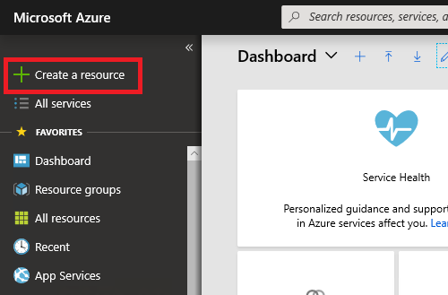
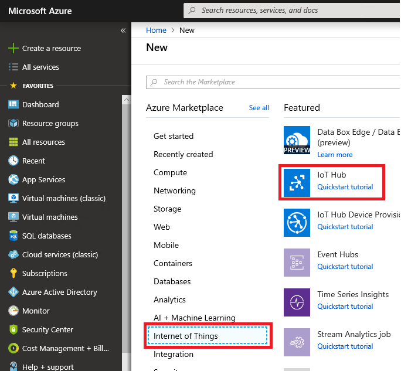
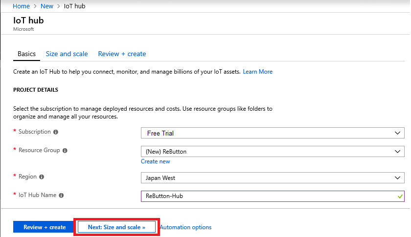
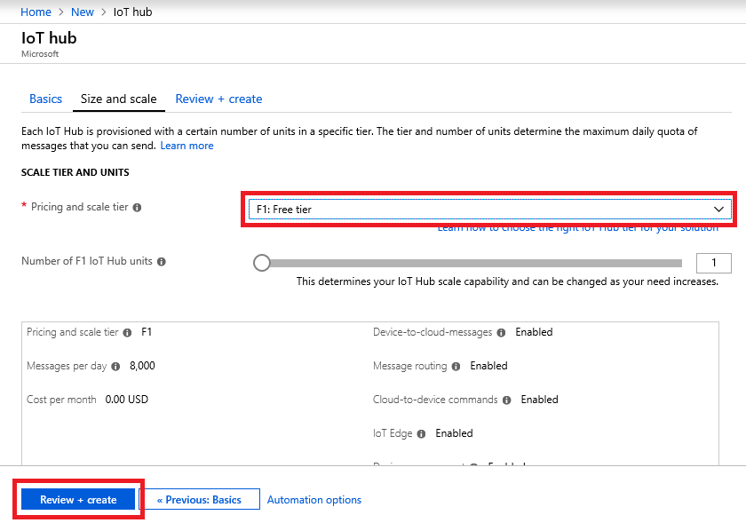
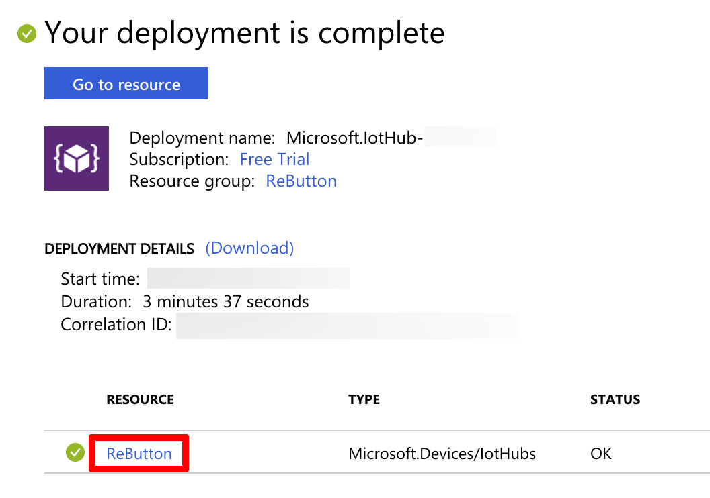
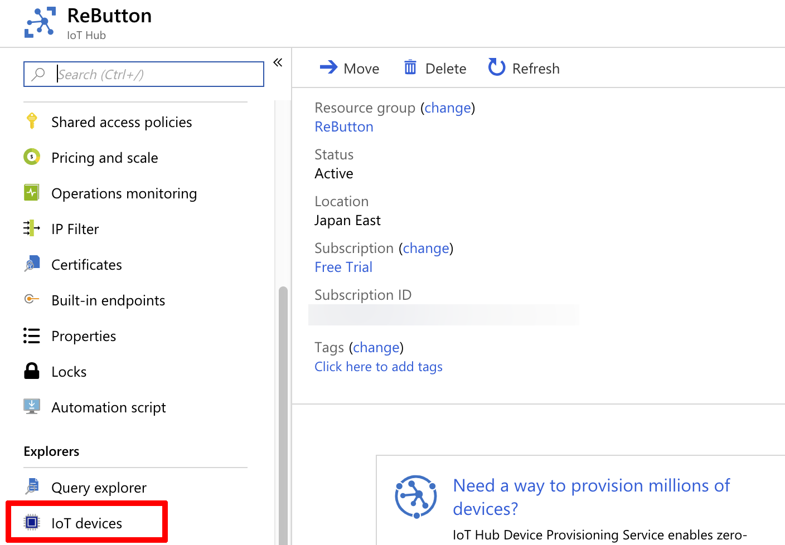
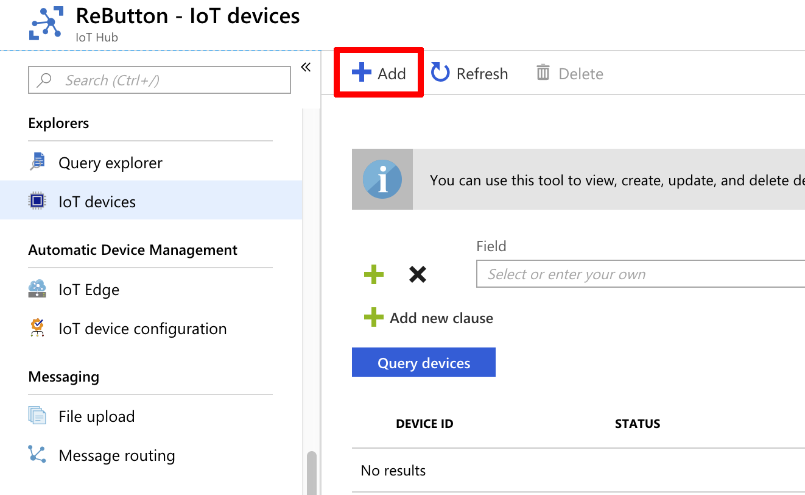
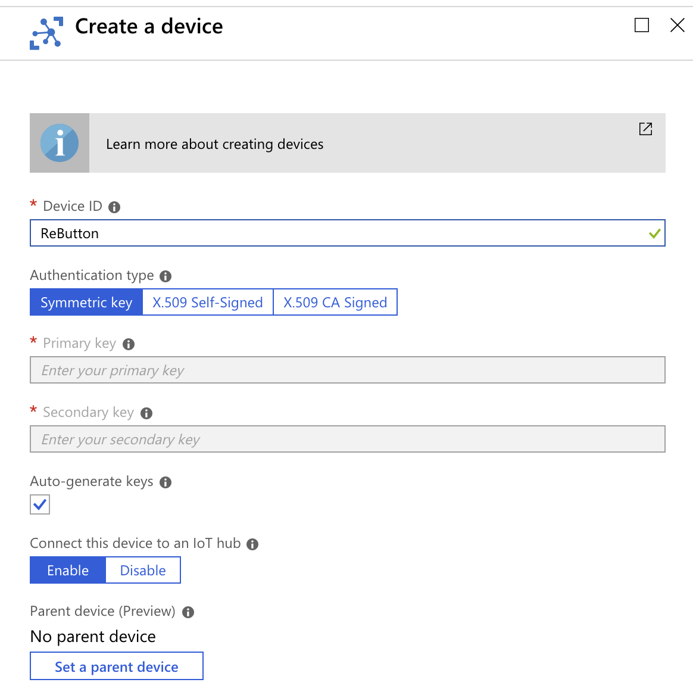
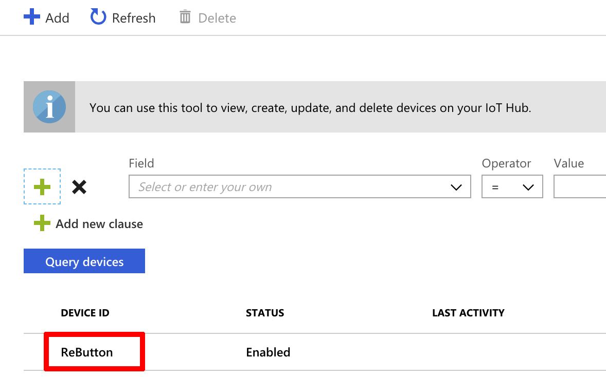
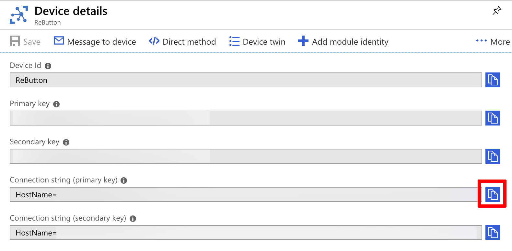

# Getting started with Azure IoT Hub
---
Legal Disclaimer  
This page was provided just to provide a convenience for users. Seeed is not responsible for any errors or omissions, or for the results obtained from the use of this information. All information in this page is provided "as is", with no guarantee of completeness, accuracy, timeliness or of the results obtained from the use of this information.

---

For more information about "Azure IoT Hub", please refer to [Azure IoT Hub](https://docs.microsoft.com/en-us/azure/iot-hub/about-iot-hub).

For pricing information about IoT Hub tiers refer to [IoT Hub pricing](https://azure.microsoft.com/en-us/pricing/details/iot-hub/).

## Step 1 : Login to Azure Portal

If you don't have an active Azure subscription, create a [free account](https://azure.microsoft.com/free) before you begin.

## Step 2 : Create Azure IoT Hub

### 2.1 : Navigate to [Azure Portal](http://portal.azure.com) with browser

### 2.2 : Click `Create a resource` on top left corner  



### 2.3 : Select `Internet of Things`, then `IoT Hub`
  


### 2.4 : Fill out following fields

|Field           | Description  |
|----------------|---------|
|Subscription    | Your subscription.  Select from the list.        |
|Resource Group  | A resource group to manage all the resources.  Select existing one from the list or create new group. |
|Region          | Location of Azure Data Center.  Select the one close to you.         |
|IoT Hub Name    | Provide a globally unique name for your IoT Hub.         |



### 2.5 : Size and Scale

Click `Size and scale`, then select `F1 : Free tier`.  

_NOTE: Only one F1 Free tier is available per subscription. If you already have F1 IoT Hub, you may need non-free tier IoT Hub. More about [IoT Hub tier](https://docs.microsoft.com/en-us/azure/iot-hub/iot-hub-scaling)._

### 2.6 : Click `Review + create` button



### 2.7 : Create Azure IoT Hub

Review your settings then, click `Create` button.

Wait until the deployment completes.

## Step 3 : Create IoT Device

### 3.1 : Navigate to Azure IoT Hub instance

After your new Azure IoT Hub is deployed, click your Azure IoT Hub resource to navigate to Azure IoT Hub instance you just created.



### 3.2 : Create IoT Device

Click  `IoT Devices`



### 3.3 : Click `Add` button

To add a new IoT Device to your Azure IoT Hub



### 3.4 : Provide a name to new IoT Device

Set Device Id (Name) for your ReButton, then click `Save` button



### 3.5 : Verify a new IoT Device for ReButton is created



## Step 4 : Connect ReButton to Azure IoT Hub

In order for ReButton to securely connect to Azure IoT Hub, Connection String needs to be saved  to ReButton.

### 4.1 : Open Device Detail page

Click on the newly created IoT Device (e.g. ReButton) to open `Device details` page.

### 4.2 : Copy `Connection String`

Copy either Primary or Secondary Connection String by clicking button on the right



### 4.3 : Save Connection String to ReButton Device

Please refer to [3-1. Azure IoT Hub](README.md#3-1-azure-iot-hub)

## Step 5 : Verify Connection

With [Azure CLI](https://docs.microsoft.com/en-us/cli/azure/) tool, verify ReButton sends messages to Azure IoT Hub.

### 5.1 : Install Azure CLI

Please refer to Azure CLI install instruction [here](https://docs.microsoft.com/en-us/cli/azure/install-azure-cli)

### 5.2 : Install IoT Extension

Install [Azure IoT extension for Azure CLI](https://github.com/Azure/azure-iot-cli-extension) with following command

```
$ az extension add --name azure-cli-iot-ext
```  

### 5.3 : Login to Azure

After getting Azure CLI installed, login to Azure

```
$ az login
```  

Web browser will launch to complete login process

### 5.4 : List Azure IoT Hub

Let's list your IoT Hub(s)  

```
$ az iot hub list
``` 

### 5.5 : Monitor Device to Cloud (D2C) message

To monitor messages from `ReButton` to IoT Hub, please run command.  

_NOTE: Replace [IoTHub Name] with your Azure IoT Hub instance from list command above._

```
$ az iot hub monitor-events -n [IoTHub Name] --properties anno sys --timeout 0
```

For more information about Azure CLI command, please see help,  

```
$ az iot hub monitor-events --help
```  
