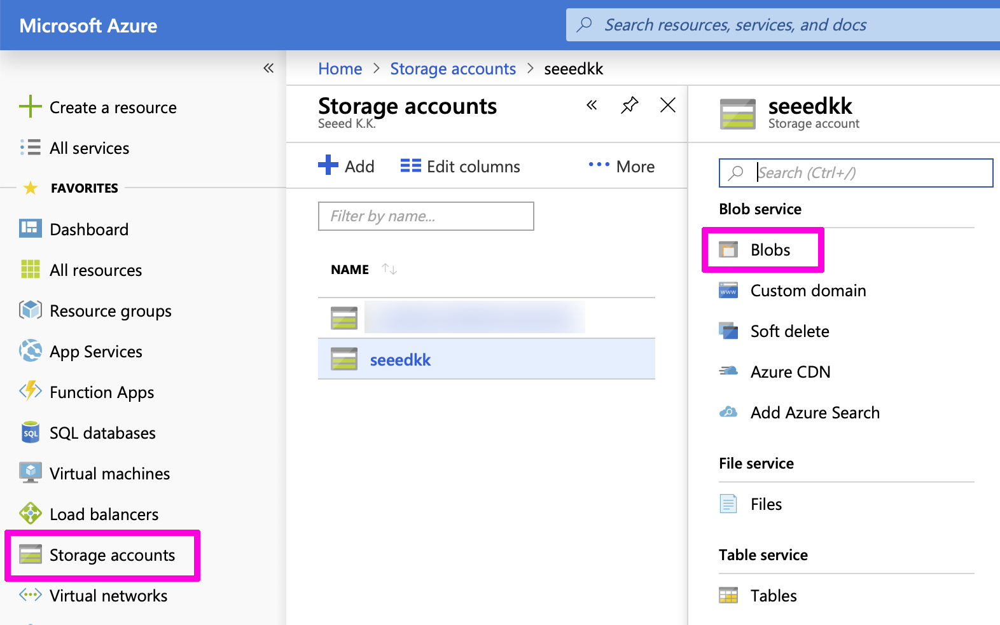

## Step 1: Azure Storageにファームウェアのバイナリファイルをアップロードしよう

[Azure CLI](https://docs.microsoft.com/ja-jp/cli/azure/)を使ってAzure Storageにファームウェアのバイナリファイルをアップロードできます。
Seeedが公開しているファームウェアを使う場合は、Step1と2の工程を省略できます。[Step3](#step-3-otaプロセス)に進んでください。

### 1.1: Azure CLIをインストールする

Azure CLIのインストール方法は[こちら](https://docs.microsoft.com/ja-jp/cli/azure/install-azure-cli)で説明しています。

[Azure StorageでのAzure CLIの使用](https://docs.microsoft.com/ja-jp/azure/storage/common/storage-azure-cli) のページはこのプロセスを遂行するのに役に立ちます。

### 1.2: 新しいStorageアカウントを作成する

Azure Storageを使うために、Storageアカウントが必要です。コンピューターとサブスクリプションの接続を設定後、新しいAzure Storageアカウントを作成できます。

```bash
az storage account create \
    --location <location> \
    --name <account_name> \
    --resource-group <resource_group> \
    --sku <account_sku>
```
例
```bash
az storage account create --location japaneast \
--name seeedkk --resource-group ReButton --sku Standard_GRS
```
IoT Hubと同じリソースグループを使えます。

### 1.3: Azureストレージアカウントを設定する
まず、使用しているアカウントから、ストレージアカウントキーを表示させます。
```bash
az storage account keys list \
    --account-name <account_name> \
    --resource-group <resource_group> \
    --output table
```
例
```bash
az storage account keys list --account-name seeedkk \
--resource-group ReButton
```
アカウントキーを入手すると、キーとアカウント名を環境変数として定義できるようになります。

```bash
export AZURE_STORAGE_ACCOUNT=<account_name>
export AZURE_STORAGE_KEY=<key>
```

### 1.4: コンテナーをつくる

Azureストレージの全てのblobはコンテナーの中になければいけません。下記のコマンドを使用して、コンテナーをつくることができます。

```bash
az storage container create --name <container_name> \
--public-access container
```

### 1.5: blobをコンテナーにアップロードする

次のコマンドで、ファームウェアのバイナリファイルをAzureストレージにアップロードできます。
```bash
az storage blob upload \
    --file <local_file_path> \
    --container-name <container_name> \
    --name <blob_name>
```
例
```bash
az storage blob upload -f ReButtonApp.1.0.bin \
--container-name rebuttonfirm --name ReButtonApp.1.0.bin
```

### 1.6: URLを取得する

[Azureポータル](https://portal.azure.com)上でアップロードしたblobのURLを確認できます。

ポータル上の`全てのサービス`の中の`ストレージアカウント`からアップロードに使ったスレージアカウントを選び、さらに`Blobs`を選んでください。



使用しているコンテナーの中から、アップロードしたファイル(blob)を確認できます。ファイルネームをクリックすることで、URLを参照できます。

## Step 2: CRCを計算する

CRCは私たちが提供している[generatecrc](https://github.com/SeeedJP/ReButton/tree/master/tools/generatecrc)コマンドを使うことで計算できます。

例:
```bash
$ cd generatecrc
$ ./generatecrc ../ReButtonApp.1.0.bin
========== ReButton Firmware Information ==========

Package path: ../ReButtonApp.1.0.bin
Package CRC: 0xbc3b
Package size: 641924

===================================================
```

## Step 3: OTAプロセス

**OTAは多くの電力を消費します。OTAが中断されることの無いよう、できるだけ新しい電池を使ってください。**

1. ReButtonのLEDが白く光るまでボタンを押し続け、APモードに移行させます。
   (リマインダー: アクセスポイント名は`AZB-xxxxxxxxxxxx`で、このページのURLは`http://192.168.0.1`です。)
1. ReButton - Homeを開き、`Firmware Update`をクリックします。
1. 以下の情報はこのドキュメントで解説しています。Seeedが公開しているファームウェアの情報は[こちら](https://github.com/SeeedJP/ReButton/tree/master/firmware)から確認でできます。
  - `Package URI` - Step 1.6にて
  - `Package CRC` - Step 2にて
  - `Package Size` - Step 2にて
1. **ReButtonのボタンを押している状態で、**`Update`をクリックしてください。
1. LEDが点滅を始めるまで、ReButtonのボタンを押し続けます。ReButtonはファームウェアをダウンロードし、CRCを確認し、新しいファームウェアを書き込みます。**この工程は30秒ほどかかります。**
1. LEDが白く光ったら、ボタンから手を離してください。APモードで新しいファームウェアが立ち上がった証拠です。
1. APモードの状態で、ReButtonのWi-FiとAzure connectionのセットアップをしてください。
