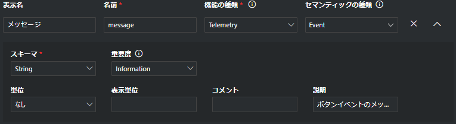
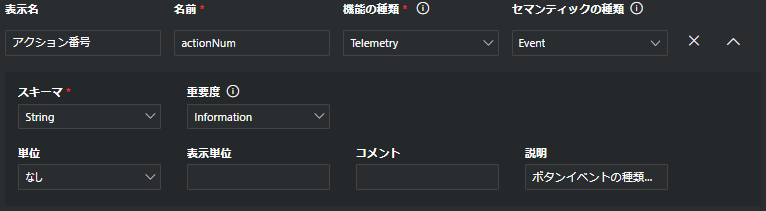
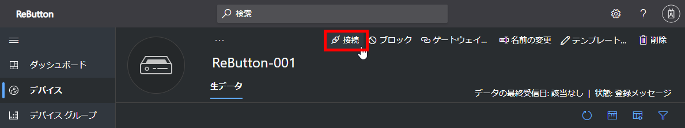
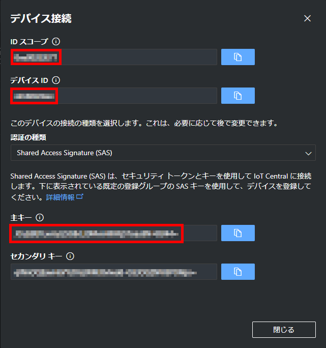

[This document in English.](https://seeedjp.github.io/ReButton/)

ReButtonは[Seeed Bazaar](https://www.seeedstudio.com/ReButton-p-2930.html)から購入できます。

# 概要

**IoTボタンでIoTソリューションを始めよう！**

Seeed ReButtonはシンプルなトリガーアクションで動作する開発用デバイスで、マルチクリックやロングクリックもサポートしています。 
Seeed Groveをつなぐことで、データポイントを増やすこともできます。

1. ReButtonを押すと電源がONになり、設定済みのWi-Fi経由でインターネットに接続します。
1. ReButtonは予め設定されているAzure IoT Central、またはAzure IoT Hubからデバイスツインの更新を受け取ります。
1. ReButtonは予め設定されているAzure IoT Central、またはAzure IoT Hubへdevice-to-cloudメッセージを送信します。
1. device-to-cloudメッセージが送られたあと、ReButtonの電源はOFFになります。


# ボタンの機能

## マルチトリガーサポート

* シングルクリック
* ダブルクリック
* トリプルクリック
* ロングクリック(>3秒)
* スーパーロングクリック (>6秒)

## Seeed Groveセンサーサポート

I2C、またはGPIOに対応しているGroveセンサーをReButtonの下部につなぐことができます。

```
※ソフトウェアの開発とアップデートが必要です。
```

## クラウドサポート

Azure IoT CentralとAzure IoT Hubをサポートしています。

## OTAサポート

ReButtonのファームウェアはover-the-airでアップデートできます。

## 省電力設計

ReButtonは単4アルカリ電池2本で動作します。

# クイックスタート

## 1. ReButtonへのアクセス

ReButtonを設定するために、アクセスポイント(AP)モードで起動します。**ReButtonはバッテリーの無駄な消費を避けるために、APモードの起動から10分経つと、自動でシャットダウンします。 そのため、先にIoT HubまたはIoT Centralの設定を済ませておくことを推奨します。**

**APモードは多くの電力を消費します。新しい電池を使ってReButtonの設定を行ってください。**

1. LEDが白く光るまでボタンを押し続けます。
  RGB LEDは青→黄→水色→白と順に変化します。白になるまで約10秒かかります。

1. ボタンから指を離して、ReButtonがAPモードにはいることを確認します。
APモードへのブートが成功すると、LEDは白く点滅します。 

1. アクセスポイントへ接続します。
  パソコンから`AZB-xxxxxxxxxxxx`という名前のWi-Fiアクセスポイントに接続します。
  (`xxxxxxxxxxxx` はReButtonのWi-FiのMACアドレスです。)  

  

1. Webブラウザーから`http://192.168.0.1`にアクセスし、ReButton - Homeを開きます。

  

## 2. Wi-Fi設定

インターネットにつなげるためにWi-Fiの設定をします。

1. ReButton - Homeで`Wi-Fi`をクリックします。

  

1. `Wi-Fi SSID`リストから、ReButtonにつなぎたいアクセスポイントのSSIDを選びます。 
  SSIDが見えない場合は、Webブラウザーを更新してください。
1. SSIDのパスワードを`Wi-Fi Passphrase`に入力します。
1. インターネットタイムサーバーを使いたい場合は、`Time Server`にFQDNを入力します。
  _デフォルトでは、ReButtonは次のサーバーと同期を試み、最初に成功したものを使用します。 pool.ntp.org -> cn.pool.ntp.org -> europepool.ntp.org -> asia.pool.ntp.org -> oceania.pool.ntp.org ._

1. `Save`をクリックします。


## 3. クラウドの設定

### 3-1. Azure IoT Hub

**※ Azure IoT Centralに接続する場合は、この手順を飛ばしてください。**

Device-to-Cloud(D2C)メッセージをAzure IoT Hubに送るために、ReButtonにConnection String(接続文字列)を保存します。

**connection string(接続文字列)の入手方法は、[こちらのページ](IoT_Hub-ja.md) を参考にしてください。.**

1. ReButton - Homeで`Azure IoT Hub`をクリックします。
1. `Azure IoT Hub connection string`にConnection String(接続文字列)を貼り付けます。
1. `Save`をクリックします。


### 3-2. Azure IoT Central

**※ section 3-1でIoT Hubを設定済みの場合は、この手順を飛ばしてください。**

Device-to-Cloud(D2C)メッセージをAzure IoT Centralに送るために、デバイスプロビジョニング情報をReButtonに保存します。

Azure IoT CentralにReButtonを接続するために、ReButtonのデバイステンプレートをAzure IoT Central アプリケーションに登録する必要があります。_詳しい情報は[デバイス テンプレートを設定する](https://docs.microsoft.com/ja-jp/azure/iot-central/howto-set-up-template)を参照してください。_

1. Azure IoT CentralでReButton用デバイステンプレートを作成します。

|Type|Field Name|Values|
|:--|:--|:--|
|テレメトリ|batteryVoltage| バッテリー電圧(Volt)|
|状態|actionNum|1:シングルクリック, 2:ダブルクリック, 3:トリプルクリック, 10:ロングクリック, 11:スーパーロングクリック|
|イベント|message||


- テレメトリ  
  

- 状態  
  

- イベント 
  

2. Azure IoT Central上でデバイスを作成します。

1. Azure IoT Centralの右上にある`接続`をクリックします。
  

1. 次の3項目をコピーします。
    1. `スコープ ID`
    1. `デバイス ID`
    1. `SAS主キー`  
    

1. ReBUtton-Homeを開き、`Azure IoT Central`をクリックします。
1. Azure IoT Centralでコピーした3項目を、それぞれ`Scope ID`、`Device ID`、`SAS Key`に貼り付けます。
1. `Save`をクリックします。  
  

## 4. 電源オフ

APモードを終了して、ReButtonの電源をオフにします。

1. `Shutdown`をクリックします。

# その他の情報
## Device To Cloud (D2C)メッセージ

ボタンを押すことで、D2Cメッセージをクラウドに送信できます。
ReButton supportsは5種類のトリガーをサポートしており、既定のD2C message stringsは下記の通りです。
|クリックの種類|LEDの色|actionNum|message|
|:--|:--|:--|:--|
|シングルクリック|ブルー|1|"Single click"|
|ダブルクリック|ライム|2|"Double click"|
|トリプルクリック|マゼンタ|3|"Triple click"|
|ロングクリック(> 3秒)|イエロー|10|"Long press"|
|スーパーロングクリック(> 6秒)|シアン|11|"Super long press"|

D2Cメッセージの例:
```json
{
  "actionNum": "1",
  "message": "Single click",
  "batteryVoltage": 2.59
}

{
  "actionNum": "2",
  "message": "Double click",
  "batteryVoltage": 2.59
}

{
  "actionNum": "3",
  "message": "Triple click",
  "batteryVoltage": 2.59
}

{
  "actionNum": "10",
  "message": "Long press",
  "batteryVoltage": 2.59
}

{
  "actionNum": "11",
  "message": "Super long press",
  "batteryVoltage": 2.59
}
```

# ファームウェアの開発
## 開発環境
[Arduino IDE](https://www.arduino.cc/en/Main/Software)をパソコンにインストールします。Webエディターはサポートされていません。

Arduino IDEの環境設定内の"追加のボードマネージャーのURL"に`https://www.seeed.co.jp/package_SeeedJP_index.json`と入力します。


ツール -> ボードから、ボードマネージャを選択します。検索ボックスに`rebutton`と入力し、ReButtonのボードパッケージを検索します。候補の中からReButtonを見つけたら、インストールボタンをクリックします。


パッケージのインストールが終わったら(数分間かかります)、Arduino IDEのツール->ボードから`ReButton`を選びます。

## ファームウェアのサンプルコード
ソースコードは以下のリンク先にあります。
* [ReButton App](https://github.com/SeeedJP/ReButtonApp)

## ファームウェアのOTAアップデート
ReButtonはファームウェアのOTAアップデートをサポートしています。  
`Firmware Update`から現在のファームウェアのバージョンを確認し、最新のバージョンに更新してください。

#### 現在のファームウェアのバージョン
ReButtonのホームの`Firmware Update`をクリックすると、現在のファームウェアのバージョンを確認できます。


#### OTAでファームウェアを更新する方法
OTAでファームウェアをアップデートする方法は、[こちら](OTA-ja.md)のページから確認できます。

## SWD (Serial Wire Debug)

ReButtonはMCUの開発用に、底面にSWDパッドを搭載しています。 **開発にはリスクが伴い、** ReButtonを置物にしてしまう危険もあります。
下図にパッドとSWD信号の対応を示します。 [TC2030-CTX 6ピンケーブル](http://www.tag-connect.com/TC2030-CTX)を使ってパッドとデバッグアダプターを接続するか、直接はんだ付けをしてください。


私たちはソフトウェア開発のために必要な情報と、手軽な価格のデバッグアダプターを準備を進めています。復旧に使える、デフォルトのファームウェアバイナリは[こちら](https://github.com/SeeedJP/ReButton/tree/master/firmware)からダウンロードできます。 バイナリファイルのターゲットは`STM32F412RG`です。デフォルトのファームウェアにはブートローダが含まれているため、書き込み先のアドレスは`0x0800 0000`です。(ブートローダー以外からバイナリを書き込む際のアドレスは`0x0800 C000`です。)

例:
```
openocd -f /usr/local/share/openocd/scripts/interface/cmsis-dap.cfg -c 'transport select swd' -f /usr/local/share/openocd/scripts/target/stm32f4x.cfg -c "program ReButton.1.0.bin verify reset 0x8000000"
```

# 仕様

## ハードウェア


|仕様||
|:--|:--|
|MCU module|MXCHIP EMW3166|
|入力|押しボタンx1|
|アウトプット|RGB LEDx1|
|拡張ポート|I2C Groveコネクタ (3.3V I/O)x1|
|Extras|ジャンパースイッチ x1|
||SWDパッド x1|
||デバッグ用UART x1|
|電源|単4アルカリ乾電池 x2|
|内部供給電圧|3.3V|
|サイズ|70mm\*70mm\*25mm|

## 設計ファイル
* [回路図](https://github.com/SeeedJP/ReButton/tree/master/electronics)  
* [筐体](https://github.com/SeeedJP/ReButton/tree/master/mechanicals)  

  
これらのファイルは [CC-BY-SA](https://creativecommons.org/licenses/by-sa/4.0/deed.en)でライセンスされています。

