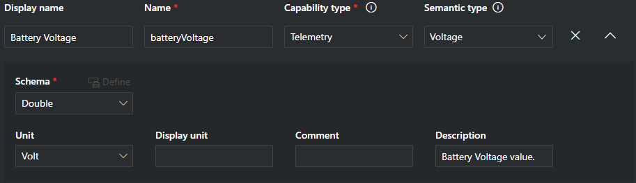
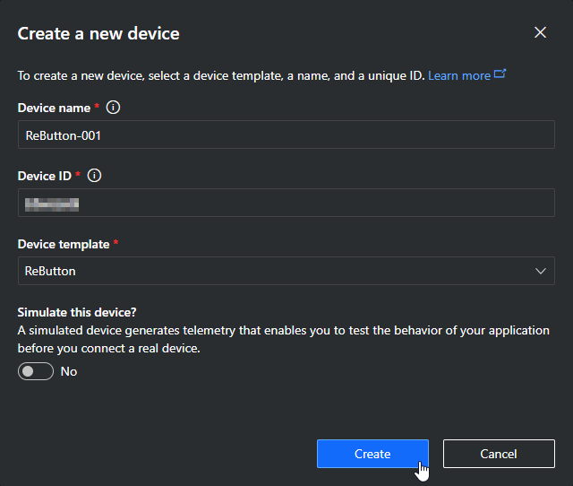
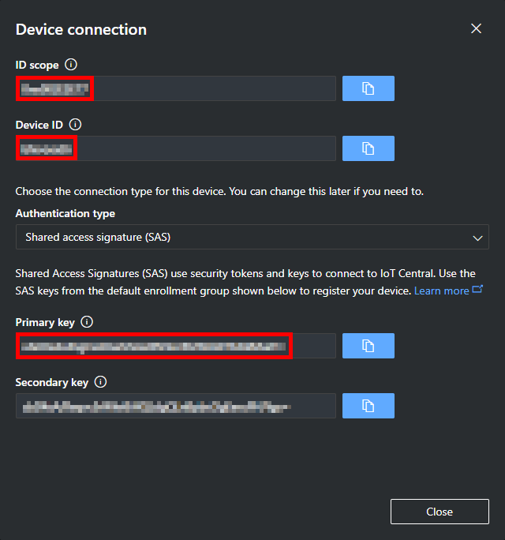

ReButton is now available at [Seeed Bazaar](https://www.seeedstudio.com/ReButton-p-2930.html).

[日本語版ドキュメント](README-ja.md)

[HoL document in Simplified Chinese](IoTinAction_Hands-on%20Lab_ReButton%20OTA%20CN.pdf)

[!WARNING]
**Warning (Updated March 7, 2023)**

Due to the migration of the root certificate for Azure IoT Hub/Azure IoT Hub Device Provisioning Service planned from February 15, 2023 to February 15, 2024 [1], it is necessary to update ReButton's firmware to **v1.12 or later** [2].

Note that **OTA updates will fail** for firmware v1.0 to 1.11, so [firmware updates via SWD](#swd-serial-wire-debug) must be performed.

##### What is happening?
Between February 15, 2023 and February 15, 2024, the root certificate of the server certificate for Azure IoT Hub/Azure IoT Hub Device Provisioning Service will be gradually changed.

* Azure IoT Hub: February 15, 2023 to October 15, 2023
* Azure IoT Hub Device Provisioning Service: January 15, 2024 to February 15, 2024

##### What happens if I don't update the firmware?
After February 15, 2023, there is a possibility that ReButton will no longer be able to connect to Azure IoT Hub/IoT Central.

---
1. See "[Azure IoT TLS: Critical changes are almost here! (…and why you should care)](https://techcommunity.microsoft.com/t5/internet-of-things-blog/azure-iot-tls-critical-changes-are-almost-here-and-why-you/ba-p/2393169)" for more details.
2. Factory default firmware is "v1.0".
[!ENDWARNING]

# Overview

**Build IoT solutions with IoT Button!**

Seeed ReButton is a developer device for simple trigger actions, supporting multiple clicks and long press.
In addition, you can connect Seeed Grove sensors to add more data points.

1. When you push ReButton, it will power up and connect to Internet via pre-configured Wi-Fi.
2. ReButton will receive Device Twin changes from pre-configured Azure IoT Central or Azure IoT Hub.
3. ReButton will send Device to Cloud Message to pre-configured Azure IoT Central or Azure IoT Hub.
4. After D2C message is sent, ReButton will shutdown.


# Key Features

## Multiple Trigger Support

* Single click
* Double click
* Triple click
* Long press (>3sec.)
* Super long press (>6sec.)

## Seeed Grove Sensor Support

Connect I2C or GPIO Grove sensors to the bottom of ReButton.
```
NOTE:
Software development/update is required.
```

## Cloud Support

Supports Azure IoT Central and Azure IoT Hub.

## OTA Support

You can update ReButton firmware over-the-air.

## Low Energy Design

ReButton runs with 2x AAA Alkaline battery.

# Quickstarts

## 1. Getting access to ReButton

Use AP Mode (Access Point Mode) to configure ReButton. **To avoid battery drain, ReButton will automatically shutdown in 10 minutes, at AP mode. So that we recommend you to setup IoT Hub or IoT Central, first.**

**AP Mode consume power. Please use fresh battery to start using ReButton.**

1. Hold button until RGB LED turns into White.
  RGB LED will start with Blue, Yellow, Cyan, then White. This will take about 10 seconds.

1. Release button and confirm ReButton is in AP mode.
  When ReButton successfully boots into AP Mode, RGB LED will blink in White.

1. Connect to AP
  Look for Wi-Fi Access Point `AZB-xxxxxxxxxxxx` and connect to it from your PC.
  (`xxxxxxxxxxxx` is MAC address of your ReButton Wi-Fi.)

  

4. Use a Web Browser to access ReButton - Home at `http://192.168.0.1`.

  

## 2. Wi-Fi Configuration

Configure Wi-Fi settings to connect to Internet.

1. Click `Wi-Fi` at ReButton - Home.

  

2. Select your Wi-Fi Access Point from `Wi-Fi SSID` list.
  If you do not see your Access Point, refresh browser.
1. Enter `Wi-Fi Passphrase` for your Wi-Fi AP.
1. In case you would like to use specific Internet Time Server, enter FQDN to `Time Server`.
  _Default Internet Time Server is pool.ntp.org -> cn.pool.ntp.org -> europe.pool.ntp.org -> asia.pool.ntp.org -> oceania.pool.ntp.org ._

1. Click `Save`.


## 3. Cloud Configuration

### 3-1. Azure IoT Hub

**NOTE: Skip to next section if you would like to connct to Azure IoT Central.**

In order to send Device to Cloud (D2C) message to Azure IoT Hub, save Connection String in ReButton.

**To get the connection string, [This](IoT_Hub.md) page could be helpful.**

1. Browse to ReButton - Home page then click `Azure IoT Hub`.
1. Paste Connection String to `Azure IoT Hub connection string`.
1. Click `Save`.


### 3-2. Azure IoT Central

**NOTE: Skip this section if you already configured IoT Hub at section 3-1.**

In order to send Device to Cloud (D2C) message to Azure IoT Central, save device provisioning information in ReButton.

In order to connect ReButton to Azure IoT Central, the device template for ReButton needs to be defined in you Azure IoT Central Application. _Please refer [Azure IoT Central Document](https://docs.microsoft.com/en-us/azure/iot-central/howto-set-up-template) for more information._

1. Create a device template for ReButton in Azure IoT Central.

|Display name|Name|Capability type|Semantic type|Schema|Unit|
|:--|:--|:--|:--|:--|:--|
|Battery Voltage|batteryVoltage|Telemetry|Voltage|Double|Volt|
|Message|message|Telemetry|Event|String||
|Action Number|actionNum|Telemetry|Event|String||

- Battery Voltage

  

- Message

  

- Action Number

  

2. Create a device in Azure IoT Central.

  

3. Click `Connect` on Top Right corner of Azure IoT Central page.

  

4. Copy 3 values.
    1. `Scope ID`
    1. `Device ID`
    1. `Primary Key`

  

5. Browse to ReButton - Home page then click `Azure IoT Central`.
1. Enter `Scope ID`, `Device ID`, `SAS Key` from Azure IoT Central.
1. Click `Save`.

  

## 4. Power off

Exit AP Mode and power off ReButton.

1. Click `Shutdown` button.

# Other informations
## Device To Cloud (D2C) Messsage

Button push will trigger D2C message to the cloud.
ReButton supports 5 types of button triggers and default D2C message strings are following.

|Clicks|RGB led|actionNum|message|
|:--|:--|:--|:--|
|Single click|Blue|1|"Single click"|
|Double click|Lime|2|"Double click"|
|Triple click|Magenta|3|"Triple click"|
|Long press (> 3sec.)|Yellow|10|"Long press"|
|Super long press (> 6sec.)|Cyan|11|"Super long press"|

Examples of D2C message:
```json
{
  "actionNum": "1",
  "message": "Single click",
  "batteryVoltage": 2.59
}

{
  "actionNum": "2",
  "message": "Double click",
  "batteryVoltage": 2.59
}

{
  "actionNum": "3",
  "message": "Triple click",
  "batteryVoltage": 2.59
}

{
  "actionNum": "10",
  "message": "Long press",
  "batteryVoltage": 2.59
}

{
  "actionNum": "11",
  "message": "Super long press",
  "batteryVoltage": 2.59
}
```

# Firmware Development
## Development environment
Please download and install [Arduino IDE](https://www.arduino.cc/en/Main/Software), not web editor.

On the preferenceof Arduino IDE, enter `https://www.seeed.co.jp/package_SeeedJP_index.json` to "Additional Boards Manager URLs".


Then goes to the Boards Manager from Tools > Board. And search ReButton board package by entering "rebutton". Then choose the candidate and click the "install" button.


After the install process ( it may take a few minutes ) you can choose "ReButton" through Tool -> Board on Arduino IDE.

## Firmware sample code
The source code is:
* [ReButton App](https://github.com/SeeedJP/ReButtonApp)

## Firmware OTA Update
ReButton supports Firmware OTA.
Browse to `Firmware Update` page to see the current vesrion of firmware and update to new firmware.

#### Current Firmware Version
Browse to ReButton - Home then click `Firmware Update` to see current firmware version of ReButton.


#### How to update firmware through OTA
For OTA firmware update process, please refer [this](OTA.md) page.

## SWD (Serial Wire Debug)

ReButton has SWD pads for MCU development. **Please do this on your own risk,**  it is easy to make your ReButton brick.
Following picture show the SWD signals of the PAD. You can connect this PADs to debug adapters by using [TC2030-CTX 6-Pin Cable](http://www.tag-connect.com/TC2030-CTX) or solder directly to the PADs.


We are preparing for providing software development informations and affordable debug adapter. For your recovering purpose, you can download ReButton default firmware binary 'ReButton.1.0_with_bootloader.bin' from [here](https://github.com/SeeedJP/ReButton/tree/master/firmware). You need to flash this binary for target `STM32F412RG` and flash address `0x0800 0000` since this default firmware binary includes bootloader.

1. Connect the debug adapter to ReButton's SWD pads.
2. Install batteries.
3. **While holding (physical) button of ReButton**, execute download.

example:
```
openocd -f /usr/local/share/openocd/scripts/interface/cmsis-dap.cfg -c 'transport select swd' -f /usr/local/share/openocd/scripts/target/stm32f4x.cfg -c "program ReButton.1.0_with_bootloader.bin verify reset exit 0x08000000"
```

When you flash a binary without bootloader (such as `ReButtonApp.1.x.bin`), you should flash address `0x0800 C000`.

# Specification

## Hardware


|Description|Value|
|:--|:--|
|MCU module|MXCHIP EMW3166|
|Input|1x Push button|
|Output|1x RGB led|
|Extension|1x I2C Grove connector (3.3V I/O)|
|Extras|1x Jumper switch|
||1x SWD pads|
||1x UART for debugging|
|Power supply|2x AAA Alkaline batteries (LR03)|
|Internal supply voltage|3.3V|
|Dimension|70mm\*70mm\*25mm|

## Design files
* [Schematics](https://github.com/SeeedJP/ReButton/tree/master/electronics)
* [Housing](https://github.com/SeeedJP/ReButton/tree/master/mechanicals)


These files are licensed under [CC-BY-SA](https://creativecommons.org/licenses/by-sa/4.0/deed.en).
